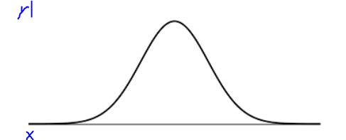

# Read: Class 09

## Dunder Methods

**What are they**? They are predefined methods that can be utilized in any class, they start and end with double underscores.

### Some examples on dunder methods and what they do:

|**Method**|**Used for**|
|----------|------------|
|\_\_init\_\_|Defines the constructor of the class|
|\_\_str\_\_|Provides an informal string representation of the object|
|\_\_repr\_\_|Provides an official string representation of the object|
|\_\_len\_\_|Provides the length, which is the number of items in the object|
|\_\_getitem\_\_|Returns the item that is in a specific index/position in the object|
|\_\_reversed\_\_|Iterates over the items within the object in a reversed order|
|\_\_add\_\_|Provides a way to perform operations on two object instances|
|\_\_call\_\_|Allows objects to be callable like regular functions|

## Statistics - Probability

**Probability** is the chance for a certain event to happen, and in order to find that probability we need to rely on the **statistics**, which are data that comes from testing a bunsh of events to see their chance of occurring.

One of the ways to calculate the probability of an event to happen is using the **normal distribution**, which is a chape that shows how likely it is for an event to happen.

The **x-axis** represents the events, and the **y-axis** represents how likely it is to happen.

 
## Things I want to know more about

- Statistics and Probability.