# Relational Databases-SQL

## SQL

**SQL** or **Structured Query Language**, is a language used to manipulate and transform data.

In **SQL** there are tables containing data, and this data can be **retrieved**, **manipulated** and/or **transformed** using ***queries***.

### **Some SQL Keywords and their Uses**:

- **SELECT**

    **SELECT** is used to retrieve specific data from a table.

    Use Example: `tutorial 1`

    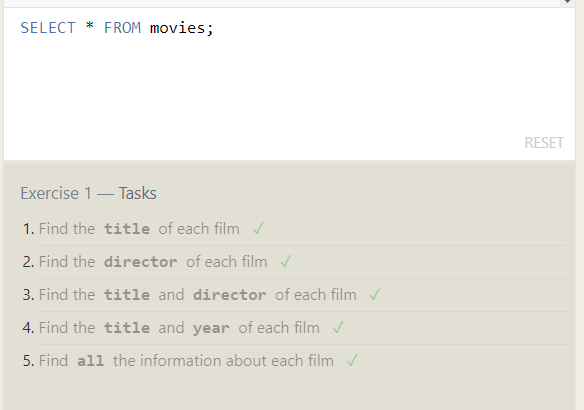

- **WHERE**

    **WHERE** is used to retrieve specific data according to a condition.

    **Note**: in order to build conditions **WHERE** can be paired with:

    1- When dealing with ***numbers***

    - **Logical Operators**
    - Keyword **"BETWEEN"** for ranges
    - Keyword **"NOT BETWEEN"** for ranges
    - Keyword **"IN"** for lists
    - Keyword **"NOT IN"** for lists

    Use Example: `tutorial 2`

    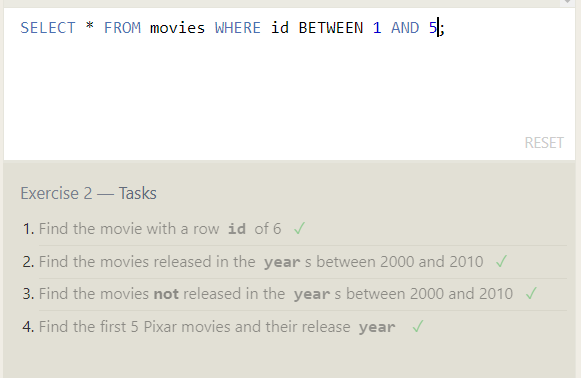

    2- When dealing with **strings/characters**

    - Operator **"="** for *case sensitive exact comparison*
    - Operator **"!=" or "<>"** for *case sensitive exact inequality comparison*
    - Keyword **"LIKE"** for *case insensitive exact comparison*
    - Keyword **"NOT LIKE"** for *case insensitive exact inequality comparison*
    - Operator **"%"** for *matching a sequence of 0 or more characters*
    - Operator **"-"** for *matching a single character*
    - Keyword **"IN"** for *string lists*
    - Keyword **"NOT IN"** for *string lists*

    Use Example: `tutorial 3`

    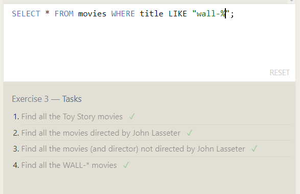

- **DISTINCT** is used to get all specified data without duplication.

- **ORDER BY**

    **ORDER BY** is used to order the retrieved data according to one of its columns.

    **Note_1**: the default behavior for **ORDER BY** is ordering in an ascending order, you can specifie the order by using **ASC** for ascending, and **DESC** for descending.

    **Note_2**: **ORDER BY** can be used with **LIMIT** for limiting the retrieved data, and **OFFSET** for specifying the starting point.

    Use Example: `tutorial 4`

    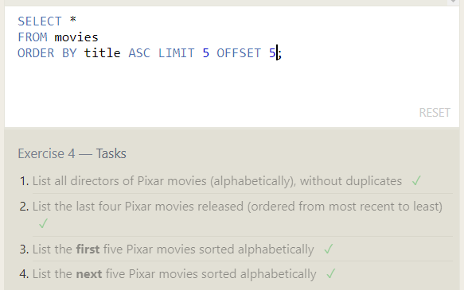

An extra example using almost all the previous key words: `tutorial 5`

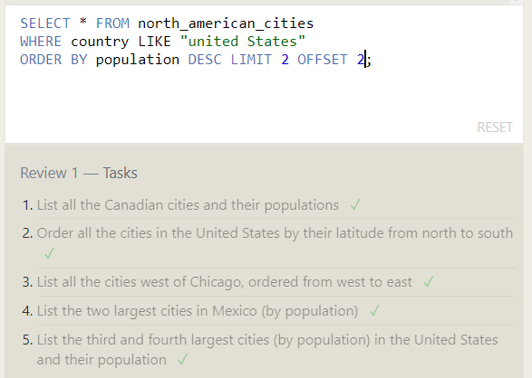

- **JOIN** 

    **JOIN** is used to combine a row data from two separate tables.

    The **INNER JOIN** will be used in this part, as it is useful for combining rows from tables that have the same keys.

    Use Example: `tutorial 6`

    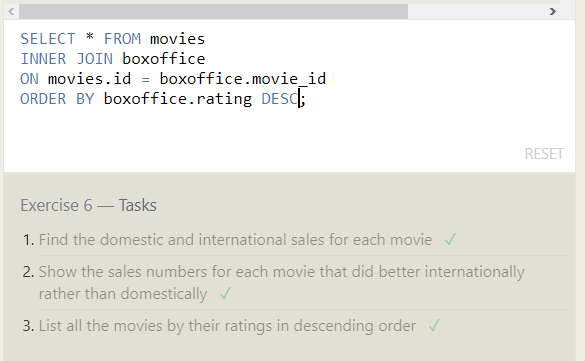

- **INSERT**

    **INSERT** is used for adding rows of data to the table.

    Use Example: `tutorial 13`

    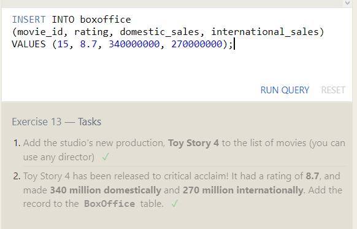

- **UPDATE**

    **UPDATE** used to change/update the data with new data.

    Use Example: `tutorial 14`

    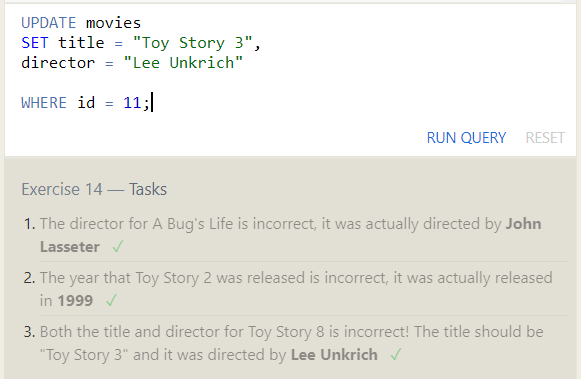

- **DELETE**

    **DELETE** is used to delete row(s) from a table.

    Use Example: `tutorial 15`

    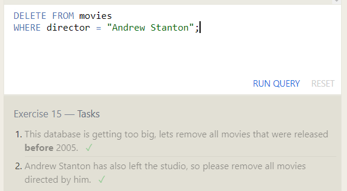

- **CREATE TABLE**

    **CREATE TABLE** used for creating a new table according to a table schema.

    **Note**: you can use the **"IF NOT EXISTS"** clause, to create a table only if it does not exist.

    Use Example: `tutorial 16`

    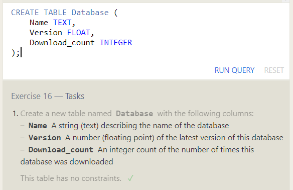

- **ALTER TABLE**

    **ALTER TABLE** used for updating (*add, remove or modify*) a table and/or it's schema.

    Use Example: `tutorial 17`

    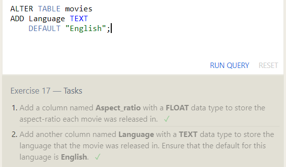

- **DROP TABLE**

    **DROP TABLE** used for deleting tables and it's schema.

    **Note**: you can use the **"IF EXISTS"** clause, to delete the table only if it exist.

    Use Example: `tutorial 18`

    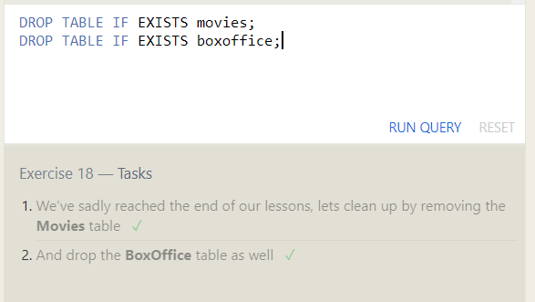

